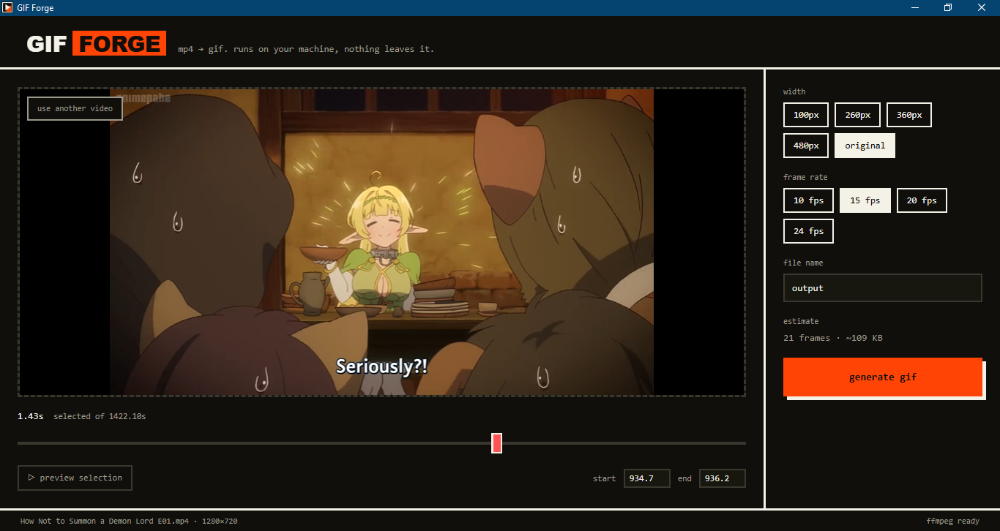

# GIF Forge



*Sample output — generated at 260px / 15fps:*


A local, no-upload MP4 → GIF converter. Pick a video, drag the trim
handles, pick a width and frame rate, and it forges a GIF with ffmpeg's
two-pass palette pipeline (much cleaner colors than a naive single-pass
GIF). Ships as a single desktop executable — nothing is uploaded anywhere.

Built with:
- **pywebview** — puts a real HTML/CSS/JS UI in a native window, backed by a
  Python API (no browser, no server).
- **ffmpeg** (via `imageio-ffmpeg`) — the actual conversion engine.
- **anime.js** — the boot-in sequence, button press feel, trim-handle
  snap, and the result-panel "pop".
- **PyInstaller** — packages everything into one `.exe`.

## What matched from your reference, and what didn't

Cloned from the imgflip screenshots: video upload, width presets
(100/260/360/480 + original), a draggable start/end trim rail with a live
selected-duration readout, an fps control, a title/file-name field, and a
generate action.

Left out on purpose, since they're either site-specific (NSFW/private
toggles, tags, watermark branding) or a much larger scope on their own
(crop, rotate, draw, add text/image, "Images to GIF" mode). The codebase
is small enough that any of those are a reasonable follow-up if you want
them — `api.py`'s `_run_job` is the one place the ffmpeg filter graph is
built.

## Design

Brutalist-minimalist: solid 2–3px borders, zero border-radius, hard
offset shadows instead of blur, one spent accent (construction orange)
on the wordmark and the primary action, a cold teal reserved for
success states. Monospace type throughout — the whole surface is numeric
readouts (fps / px / seconds), so mono is functional, not decorative.
Tokens live at the top of `ui/style.css` if you want to retheme it.

## 1. Run it from source

```bash
python -m venv .venv
source .venv/bin/activate        # .venv\Scripts\activate on Windows
pip install -r requirements.txt
python main.py
```

Platform notes for pywebview's renderer:
- **Windows** — uses the Edge WebView2 runtime, preinstalled on current
  Windows 10/11. If a fresh machine is missing it, the "Evergreen
  Bootstrapper" from Microsoft installs it in seconds.
- **macOS** — uses the system WebKit via PyObjC. If `pip install` didn't
  pull the Cocoa bridge in, run `pip install pywebview[cocoa]`.
- **Linux** — needs a webview backend package: `pip install pywebview[qt]`
  (Qt/QtWebEngine) or the GTK equivalent, plus the matching system
  packages (e.g. `python3-gi`, `gir1.2-webkit2-4.0`).

## 2. Drop in anime.js (optional but recommended)

The app runs today with a small built-in animation fallback
(`ui/vendor/anime-fallback.js`), so nothing is broken out of the box.
For the real thing — proper spring/elastic easing on the result-panel
pop — grab **anime.js v3** and place it at `ui/vendor/anime.min.js`:

- https://github.com/juliangarnier/anime → `lib/anime.min.js` from a
  release, or `npm install animejs` and copy
  `node_modules/animejs/lib/anime.min.js`.

`index.html` loads `vendor/anime.min.js` first, then the fallback (which
no-ops if the real library is already present), so dropping the real
file in just upgrades the animation quality with no code changes.

## 3. Build the Windows exe

```bash
pip install -r requirements.txt
python build.py            # vendors ffmpeg's binary into ./bin
pyinstaller gif_forge.spec
```

Output: `dist/GIF Forge.exe` — a single windowed executable with the UI,
ffmpeg, and the app icon (`assets/icon.ico`) all bundled in. Nothing else
needs to be installed on the target machine.

To rebuild the icon (it's generated, not drawn by hand) or restyle it,
edit the `make()` function you'd write against Pillow — the current one
is a 256×256 orange-on-ink play triangle matching the in-app palette.

On macOS/Linux the same spec produces a onefile binary for that platform
(`dist/GIF Forge`); turning it into a proper macOS `.app` bundle needs an
extra PyInstaller `BUNDLE(...)` step with an `Info.plist`, which isn't
included here since "exe" pointed at Windows.

## Project structure

```
gif-forge/
├── main.py              entrypoint — opens the pywebview window
├── api.py               backend: ffmpeg probing + two-pass conversion
├── build.py             vendors ffmpeg into ./bin before packaging
├── gif_forge.spec       PyInstaller build spec
├── requirements.txt
├── assets/
│   └── icon.ico / icon.png
└── ui/
    ├── index.html
    ├── style.css
    ├── app.js
    └── vendor/
        ├── anime.min.js        ← you add this (see step 2)
        └── anime-fallback.js
```

## How the conversion works

Single-pass GIF encoding looks muddy because GIF is limited to a 256-color
palette and ffmpeg's default dithering is rough. `_run_job` in `api.py`
instead runs ffmpeg twice per export:

1. **`palettegen`** — analyzes just the trimmed range and builds an
   optimal 256-color palette for *that* clip.
2. **`paletteuse`** — re-encodes using that palette with Bayer dithering.

Both passes share the same `fps` + `scale` filter chain so the palette is
generated at the exact size/rate the final GIF will use.

## Troubleshooting

- **"that didn't work" with an ffmpeg error** — the error panel shows the
  tail of ffmpeg's own output, which almost always names the problem
  (bad path with unusual characters, unsupported codec, disk full).
- **Video won't preview but the GIF still generates fine** — the `<video>`
  tag's ability to preview depends on codecs available to the OS's media
  framework; ffmpeg's own decoding (used for the actual GIF) supports far
  more formats than in-browser playback does.
- **exe is large** — ffmpeg's static binary is the bulk of it (tens of
  MB); that's the tradeoff for a zero-dependency install.
